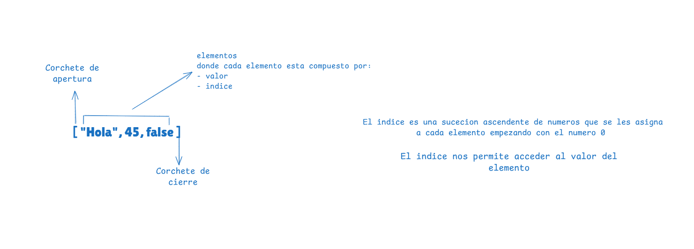
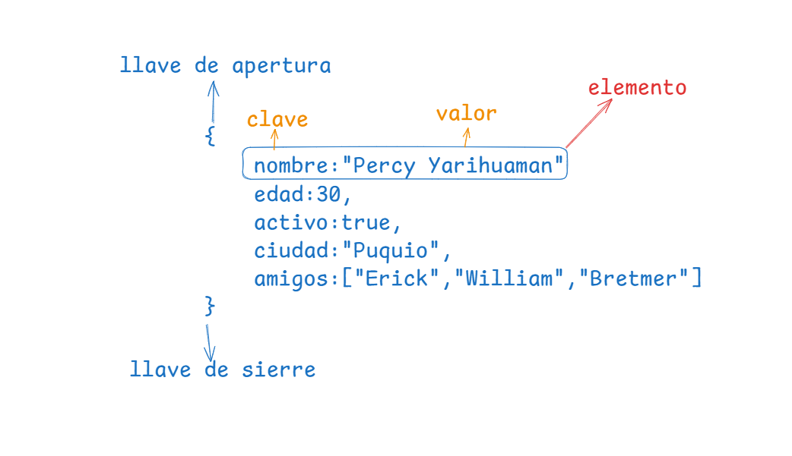

# TALLER DE REPASO DE JAVASCRIPT
>[!WARNING] OBSRVACION: Quokka se debe ejecutar en cada archivo

>[!TIP] Quokka detecta que en nuestro proyecto tenemos nodejs y lo ejecuta para poder ver la consola en vivo
## 1. TIPOS DE DATOS 
- Es la manera como capturamos la informacion
- En jacascript se clasifican en dos grandes grupos:

>[!TIP] 
Javascript tiene funciones predeterminadas por ejemplo para mostrar un mensaje por consola con `console.log()`, para poder vireficar que tipo de dato estamos manejando en javasript tambien tenemos una funcion por defecto llamado `typeof()`
### Primitivos
Son datos que siempre existiran
1. Numericos:
    - enteros positivos
    - enteros negativos
    - decimal positivos
    - decimal negativos
    - NaN ( not a number )
2. Textos:
   - caracteres                   --> puede ser una linia de 8 bits 10001001 - 97 - A
   - caracteres especiales        --> 01001001  010100101 - 252 - @
   - String                       --> 
3. Booleanos
   - True             --> 1
   - False            --> 0
### Estructurados
1. Array (Lista)
   - array de tipo numerico
   - array de tipo string
   - array de tipo mixto
 - como esta estructura un array en jacascript

2. Objetos (Diccionario)
   
   Son similares a las listas con la unica diferencia que en vez de tene rvalor e indice sus elementos trabajan con clave:valor
- como esta estructurado un objeto en javascript

## 2. VARIABLES (enlaces, binding)
 Es la tecnica que se usa para apuntar en una direccion en memoria y al valor o dato relacionado o que se encuentre almacenado en ese momento.

Las *variables* en JavaScript se utilizan para almacenar datos que pueden cambiar durante la ejecución del programa. El término "enlace" o "binding" se refiere a la asociación de un nombre con un valor.

- Tenemos dos pasos para crear una variable
  - pimero declarar la variabe/constante
  - segundo inicializar la variable/constante

**Observacion** 

para crear una variable primero tenemos que crear el enlace y luego darle el nombre de la variable o constante: para las variables tenemos las palabras reservadas `Keyword`- `let`, `var`. Para las costantes tenemos la palabra reservada: `Keyword`-`const`

**Recomendaciones** 
- `let` usar cuando el valor tendra que cariar
- `const` usar cuando el valor sera el mismo siempre
- `var` evitar usar

`let` y `var` ambos nos permiten crear variables su unica diferencia es el alcanse ambito o `escope` (averiguar)
## 3. OPERADORES
## 4. FUNCIONES
## 5. METODOS PARA TRABAJAR CON DATOS ESTRUCTURADOS
Cuando trabajamos con datos estructurados (como arreglos o listas y objetos), necesitamos realizar ciertas operaciones básicas para gestionar, manipular y organizar la información. Estas operaciones son universales en casi todos los lenguajes de programación.

1. ✅ Acceder

¿Qué es?
Obtener el valor de un elemento o propiedad dentro de una estructura de datos como un areglo (`array`) o un objeto (`objet`) sin modificarlo. 

¿Para qué sirve?
Permite leer información sin modificarla. 

2. ✏️ Modificar

¿Qué es?
Cambie el valor de un elemento o propiedad dentro de una estructura ya existente. 

¿Para qué sirve?
Actualizar información cuando cambia, como corregir un dato o reflejar nuevos valores. 

3. ➕ Crear

¿Qué es?
Definir una nueva estructura de datos desde cero. 

¿Para qué sirve?
Inicializar listas, objetos o colecciones vacías o con valores iniciales. 

4. 🔧 Insertar

¿Qué es?
Agregue uno o más elementos nuevos en una posición específica del arreglo (al inicio, al final o en medio). 

¿Para qué sirve?
Ampliar una lista con nuevos datos sin reemplazar los existentes. 

5. ❌ Eliminar

¿Qué es?
Remove un elemento o propiedad de la estructura de datos. 

¿Para qué sirve?
Limpiar datos obsoletos, incorrectos o innecesarios. 

6. 🔀 Ordenar

¿Qué es?
Reorganizar los elementos de un arreglo según un criterio (alfabético, numérico, por fecha, etc.). 

¿Para qué sirve?
Mejorar la lectura, búsqueda o presentación de datos. 