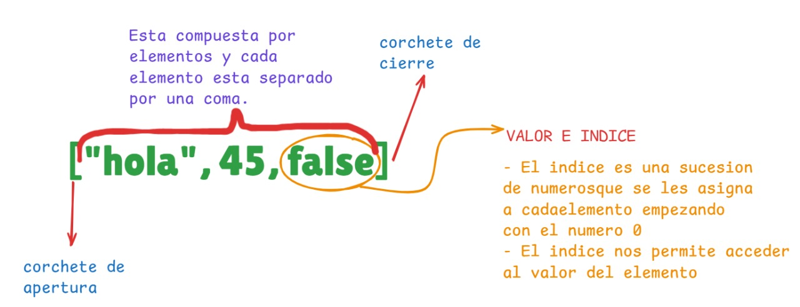
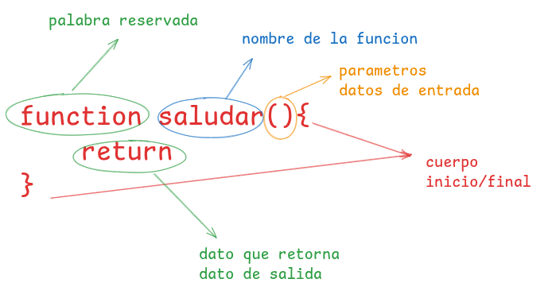

# TALLER DE REPASO DE JAVASCRIPT
>[!WARNING] OBSRVACION: Quokka se debe ejecutar en cada archivo

>[!TIP] Quokka detecta que en nuestro proyecto tenemos nodejs y lo ejecuta para poder ver la consola en vivo
## 1. TIPOS DE DATOS 
- Es la manera como capturamos la informacion
- En jacascript se clasifican en dos grandes grupos:

>[!TIP] 
Javascript tiene funciones predeterminadas por ejemplo para mostrar un mensaje por consola con `console.log()`, para poder vireficar que tipo de dato estamos manejando en javasript tambien tenemos una funcion por defecto llamado `typeof()`
### Primitivos
Son datos que siempre existiran
1. Numericos:
    - enteros positivos
    - enteros negativos
    - decimal positivos
    - decimal negativos
    - NaN ( not a number )
2. Textos:
   - caracteres                   --> puede ser una linia de 8 bits 10001001 - 97 - A
   - caracteres especiales        --> 01001001  010100101 - 252 - @
   - String                       --> 
3. Booleanos
   - True             --> 1
   - False            --> 0
### Estructurados
1. Array (Lista)
   - array de tipo numerico
   - array de tipo string
   - array de tipo mixto
 - como esta estructura un array en jacascript


2. Objetos (Diccionario)
   
   Son similares a las listas con la unica diferencia que en vez de tene rvalor e indice sus elementos trabajan con clave:valor
- como esta estructurado un objeto en javascript


## 2. VARIABLES (enlaces, binding)
 Es la tecnica que se usa para apuntar en una direccion en memoria y al valor o dato relacionado o que se encuentre almacenado en ese momento.

Las *variables* en JavaScript se utilizan para almacenar datos que pueden cambiar durante la ejecución del programa. El término "enlace" o "binding" se refiere a la asociación de un nombre con un valor.

- Tenemos dos pasos para crear una variable
  - pimero declarar la variabe/constante
  - segundo inicializar la variable/constante

**Observacion** 

para crear una variable primero tenemos que crear el enlace y luego darle el nombre de la variable o constante: para las variables tenemos las palabras reservadas `Keyword`- `let`, `var`. Para las costantes tenemos la palabra reservada: `Keyword`-`const`

**Recomendaciones** 
- `let` usar cuando el valor tendra que cariar
- `const` usar cuando el valor sera el mismo siempre
- `var` evitar usar

`let` y `var` ambos nos permiten crear variables su unica diferencia es el alcanse ambito o `escope` (averiguar)
## 3. OPERADORES
 Su clasificacion general se devide en tres:
 1. Operadores unarios
    - Los operadores unarios son aquellos que estan ubicados a la izquierda del valor y que retornan un nuevo valor.
      - Operador de negacion
 2. Operadores binarios
    - Los operadores vinarios son aquellos que estan en medio de dos valores y que restornan un unico valor.
      - Operadores aritmeticos
      - Operadores de comparacion
      - Operadores lógicos
 3. Operadores ternarios
    - Los operadores ternarios son aquellos que evaluan tres valores y que reternoan un solo valor.
      - Operador condicional
## 4. CONTROLES DE FLUJO
Nuestros programas en javascript contienen mas de una sentencia y las sentencias son ejecutados una a una como si fuera una historia, de arriba hacia abajo como un camino recto.

### 1. Controles de desision (if-else)
Javascript nos permite crear caminos alterntivos en nuestros programas, dependiendo de una desision a esto se le conoce como caminos o ejecucuion condicional que ejecutara una sentencia u otra teniendo en cuenta la condicion y asi podemos crear multiples caminos u oppciones en otros programas.

Si tenemos una condicion verdadera se ejevitara una sententencia y si tenemos una condicion falasa se ejevutara otra sentencia totalmente distinta.

**Observacion:** la ejecucion condicional rompe el flujo normal de una programa
### 2. Bucles (for)
En JavaScript, los bucles for nos permiten repetir una o varias instrucciones varias veces de forma controlada. Esto se conoce como repetición o iteración, y se usa cuando sabemos cuántas veces queremos que se repita un bloque de código.

El bucle for tiene tres partes: la inicialización (por ejemplo, iniciar una variable en 0), la condición (que se evalúa antes de cada repetición), y la actualización (que suele incrementar o modificar el valor de la variable). Si la condición es verdadera, se ejecuta el bloque de código; si es falsa, el bucle se detiene.

**Observación**: el bucle for es ideal cuando conocemos de antemano el número de repeticiones que deben realizarse.
### 3. Bucles (while)
En JavaScript, el bucle while nos permite ejecutar repetidamente una sentencia o bloque de código mientras una condición específica se mantenga verdadera. Este tipo de bucle es útil cuando no sabemos exactamente cuántas veces se debe repetir una acción, pero sí sabemos la condición que debe cumplirse para seguir repitiendo.

Primero se evalúa la condición: si es verdadera, se ejecuta el bloque de código; luego vuelve a evaluar la condición, y así sucesivamente hasta que sea falsa. Una vez que la condición deja de cumplirse, el bucle termina.

**Observación:** el uso incorrecto del bucle while puede generar un bucle infinito si la condición nunca llega a ser falsa.


## 5. FUNCIONES
Las funciones en JavaScript son bloques de codigo que se ejecutan de manra independiente, podemos decir tambien que son miniprogramas que toman datos como dentrada y retornan otros datos como salida.

Las funciones son fundamentales para el correcto ordenaminto de nuestro codigo, ademas nos permite separar de una manera mas ordenda nuestra logica y evitar repetir el codigo muchas veces.

Existen tre tipos de funciones:

### tipos de funciones:
#### 1. Funciones por declaracion
Son funciones clasicas en JavaScript, se escriben con la palabra `function` y tienen hoisting osea es decir que se pueden usar antes de que esten escritas el codigo

Este tipo de funcion es la mas conocida y la mas usada, su estrucutra es la siguiente:



#### 2. funciones por expresion
Es una funcion que permite guardar una funcion dentro de una variable, lo que nos permitira posteriormente ejecutar la variable como si fuera una funcion.
#### 3. funciones flecha(arrow function)
Las funciones flecha son una forma más corta y moderna de escribir funciones en JavaScript, introducidas en ES6 (2015).
Se llaman así porque usan la sintaxis de una flecha (`=>`) en lugar de la palabra reservada `function`.

Su principal característica es que no crean su propio contexto de `this`, sino que heredan el `this` del lugar donde fueron escritas.
Esto las hace especialmente útiles cuando trabajamos dentro de objetos, clases o funciones que requieren mantener el mismo `this`.

>[!TIP] 
**this**--> es una palabra especial que hace referencia al objeto que está “dueño” o en el contexto donde se está ejecutando una función.
## 6. METODOS PARA TRABAJAR CON DATOS ESTRUCTURADOS
Son funciones que dan funcionalidades extra alos tipos de datos en los cuales se aplica, un metodo es antecedido por un tipo de dato y ui punto.

**ejemplo**

el ejemplo mas claro de un metodo es el `.length` - este metodo nospermite o nos retorna la contidad d caracteres de un string o la cantidad de elementos de una lista
```js
"hola".lehgth // 4
[2,5,4,6,5].length // 5
```
> [!TIP] 
los metodos en su mayoria solo se alican a tipos de datos string, listas y objetos, en su gran parte son aplicados en listas

### 6.1. metodos para string - cadenas de texto
#### length:
Debuelve la longitud de una cadena
```js
let mensaje = "hola como estan"
console.log(mensaje) //15
```
#### toLowerCase:
devuelbe una cadena en ninusculas
```js
let texto ="HOLA"
console.log(texto.toLowerCase()) //hola
```
#### toUpperCase:
debuelve una cadena en mayusculas
```js
let texto="hola"
console.log(texto.toUpperCase()) // HOLA
```
#### concat:
Este metodo combina el texto de dos o mas numeros
```js
let nombres="kcapa"
let nombres="hola"
// let concatenado= nombre+saludo
console.log(saludo.concat(nombre)) // hola kcapa
```
#### Trim:
Este metodo elimina los espacios que existen al inicio y al final de una cadena o texto.

```js
let texto="   hola"
texto.trim()
```

#### Slice:
Este metodo nos permite extraer partes de una cadena especificando sus indices donde comenzr y asta donde mostrar
```js
let parrafo= " hola soy percy"
parrafo.slice(9, 14) // percy
parrafo.slice(5, 8) // soy
```

#### Split:
Este metodo retorna una lista basandose en un separador que se le indique 
```js
let parrafo="solo se que nada se"
parrafo.split(" ") // ["solo", "se", "que", "nada", "se"]

let url="google.com/search?=gatitos"
let gatito=url.split("=") // ["google.com/search?", "gatitos"]
console.log(gatitos[1]) // gatitos
```
### 6.2. metodos para listas - arrays
#### 1. ➕ Para crear una lista

- **¿Qué es?**

Definir una nueva estructura de datos desde cero. 

- **¿Para qué sirve?**

Inicializar listas, objetos o colecciones vacías o con valores iniciales. 
```js
let lista=[]
```

#### 2. 🔧 Agregando elementos a una lista

- **¿Qué es?**

Agregue uno o más elementos nuevos en una posición específica del arreglo (al inicio, al final o en medio). 

- **¿Para qué sirve?**

Ampliar una lista con nuevos datos sin reemplazar los existentes. 
```js
lista[0]=Manzana
```
- **PUSH**
  
  El metodo `.push` agrega elementos al final de una lista
  ```js
   let lista=[]
   lista.push("Manzana")
   ```

- **UNSHIFT**
  
  El metodo `.unshift` agrega elementos al inicio de una lista
  ```js
   let amigos=['ronny', 'Lisbeth', 'pedro']
   amigos.unshift("juan")
   ```

#### Removiendo elementos de una lista
- **POP**
  
  El metodo `.pop` al contarrio de push extrae el ultimo elemento de una lista.

- **SHIFT**

  El metodo `.shift` al contario de unshift extrae el primer elementoi de una lista
#### Eliminar elementos de una lista
- **DELETE**
  
  Elimina un elemento en base a sus indice
  ```js
  let texto=["hola", "como", " ", "estas"]
  delete texto[2]
  ```
- **SPLICE**
  
  Este metodo elemina el elemento en base a su posision (indice) y a la cantidad de elementos a eliminar.
  ```js
  let vocales=["a", "e", "e", "i", "o", "u"]
  vocales.splice(2,1)
  ```

#### Combinar o unir listas (arrays)
- **CONCAT**
  
  Este metodo crea un nuevo array que contiene los elementos del array original seguido por los elementos de uno o mas arrays proporcionados
  ```js
  let amigosPrimaria=["jorge", "alfredo", "luis",]
  let amigosSecundaria=["raul", "carlos", "santi",]
  let amigosSuperior=["jusue", "maria", "jans",]
  let friends=amigosPrimaria.concat(amigosSecundaria, amigosSuperior)
  ```
Una funcion de tipo callback son funciones que reciben como parametro una funcion anonima.
```js
let amigos=['dara', 'jose', 'ashly']
amigos.find((nombre)=>{nombre=='dara'})
```
```js
let numeros=[5, 4, 20]
let numeros=numeros.filter(num=>num<6)
```
#### Metodos para iterar una lista (elementos)
- **forEach**
  
  Esta metodo ejecuta una funcion anonima por cada elemento de un array 
  ```js
  let numeros=[1, 2, 3, 4, 5, 6]
  numeros.forEach(n=>{console.log(n+1)}) // esto esto es una funcion anonima de tipo flecha
  ```
- **map**
  
  Esta metodo ejecuta una funcion anonima por cada elemento de un array, generando una ueva lista
  ```js
  let numeros=[1, 2, 3, 4, 5, 6]
  let nuevosNumeros=numeros.map(n=>{return n+1})
  ```
#### metodos para buscar elementos en una lista
- **includes**
  
  Este metodo busca un valor en espesifico y devuelve un valor booleano en caso de encontar el valor buscado retorna True caso contrario False
  ```js
  let vocales= ['a', 'i', 'o', 'u']
  let buscaE= vocales.includes('e')
  // esto retornara False
  ```
- **filter**
  
  Este metodo se usa para encontrar elementos dentro de una lista que cumpla con sierta condicion.
  ```js
  let nmrs=[2, 4, 6, 8, 1, 5]
  // deseo una lista con los numeros con una lista que sea menor a 4
  let nNumeros= nmrs.filter(n=>{n<4>})
  ```
- **find**
  
  Este metodo se usa para encontrar el primer elemento que cumpla con sierta consicion, a diferencia del filter slo retorna un elemento el que coincida con la condicion
  ```js
  let lisNumeros=[10, 11, 3, 20, 5]
  mayorDiez=lisNumeros.find(n=>{return n>10})
  console.log(mayorDiez)  //slo erornara el primero en este caso el 11
  ```
### 6.3. metodos para objetos

Cuando trabajamos con datos estructurados (como arreglos o listas y objetos), necesitamos realizar ciertas operaciones básicas para gestionar, manipular y organizar la información. Estas operaciones son universales en casi todos los lenguajes de programación.
#### Creando un objeto
```js
// Esto es un objeto o diccionario vacio
let objeto={}
```
#### Agregando elementos a un objeto
Recuerden que ele elemneto de un objeto estan conformado por `clave : valor`
```js
objeto["nombre"]="percy"
objeto["edad"]=20
objeto["cui"]=71500856
```
#### Actualizando elementos a un objeto
Para realizar la actualizacion de un valor del elemento teenmos que acceder atravez de sus vlave y asignarle el nuevo valor.

**observacion** la clave debe ser la misma a actualizar de no existir la clave creara una nueva
```js
objeto["edad"]=22
```
#### eliminando elementos de nuestro objeto
Para eliminar un elemento de un  objeto hacemos uso de un operador unario `delete`.
```js
delete objeto.nombre
```
## 7. es6
## 8. DOM
Esn una api del navegador y es el que maneja request y el respons y esla que permite que cliente se pueda comunicar con el navegador 